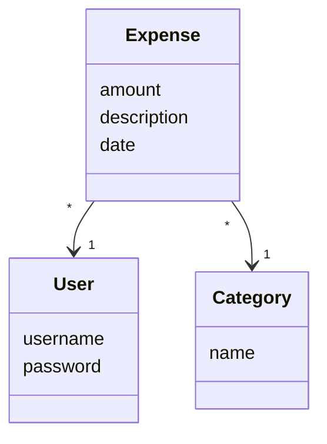
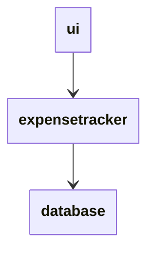
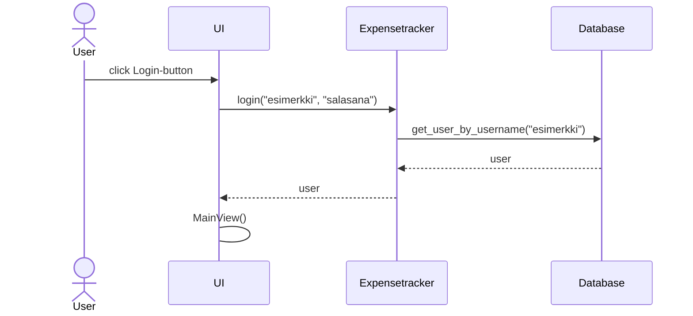
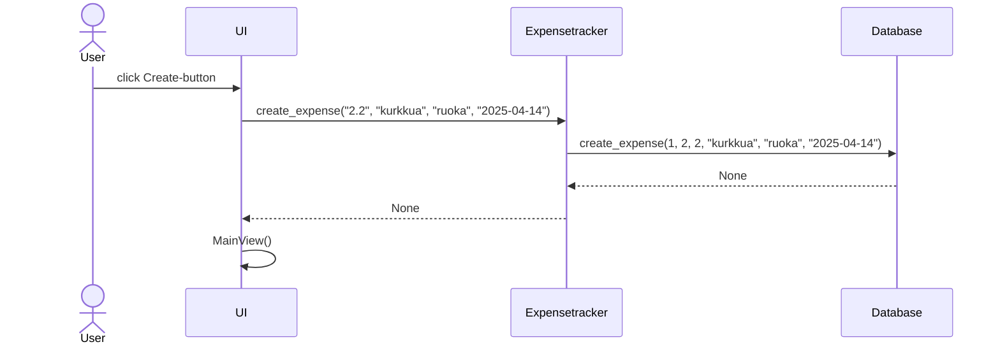

# Arkkitehtuuri

Ohjelma käyttää kolmea keskeistä luokkaa: Expense-luokka kuvaa kirjattua menoa, User-luokka käyttäjää ja Category menokategoriaa. Tietokannassa jokainen näistä luokista vastaa yhtä taulua.

Sovelluksen rakenne on kolmikerroksinen: Ohjelman sovelluslogiikka on eriytetty erilliseen luokkaansa nimeltä Expensetracker. Sovelluksen käyttöliittymä kommunikoi Expensetracker-luokasta luodun globaalin instanssin kanssa ja näyttää siltä saamansa datan. ExpenseTracker-luokka ottaa konstruktorissa argumenttina tietokantayhteyden ja tallentaa ja lukee dataa tämän yhteyden kautta.

## Järjestelmän pääkomponentit

### ExpenseTracker

Sovelluslogiikasta vastaa luokka nimeltä ExpenseTracker. Tästä luokasta luodaan globaali instanssi jota käyttöliittymä käyttää. Luokka tarjoaa funktioita esimerkiksi liittyen käyttäjien hallintaan ja menojen kirjaamiseen. Kaikki tallentamista vaativa data annetaan tietokannalle tallennettavaksi. Yhteys tähän tietokantaan annetaan luokan konstruktorissa.

### UI

Komponentti, joka vastaa graafisesta käyttöliittymästä hyödyntäen TkInter-kirjastoa. Kommunikoi globaalin ExpenseTracker-instanssin kanssa suorittaakseen käyttäjän haluamat toiminnot ja näyttääkseen tarvittavan datan. Sisältää kolme päänäkymää:
- LoginView, joka tarjoaa ikkunan sisäänkirjautumiseen ja uuden käyttäjän luontiin
- MainView, joka tarjoaa käyttöliittymän uusien menojen kirjaamiseen ja vanhojen menojen tarkasteluun
- StatsView, joka näyttää erillisessä ikkunassa statistiikkaa käyttäjän kuukausittaisista menoista valitulta kuukaudelta

### DataBase

Luokka, joka tarjoaa tietokannan käsittelyyn tarvittavat funktiot. Luo konstruktorissa yhteyden tietokantaan ja on tämän jälkeen valmis suorittamaan ExpenseTracker-luokan pyytämät tehtävät. Tarvittaessa tiedon tallennustapa voidaan muuttaa koskematta sovelluslogiikkaan muokkaamalla tätä luokkaa (kts. [testit](../src/tests/expensetracker_test.py)).

## Ohjelman toiminta

Käyttäjän sisäänkirjautuminen noudattaa seuraavaa sekvenssikaaviota:

Menon kirjaamista kuvaava sekvenssikaavio:

