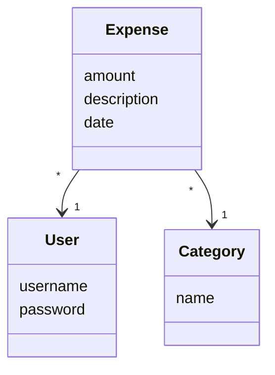
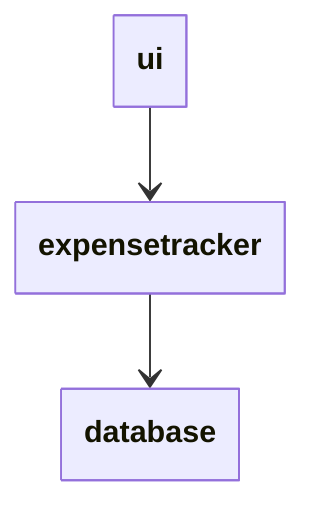

# Arkkitehtuuri

## Luokkakaavio

```mermaid
 classDiagram
      Expense "*" --> "1" User
      Expense "*" --> "1" Category
      class User{
          username
          password
      }
      class Expense{
          amount
          description
          date
      }
      class Category{
        name
      }
```

## Pakkauskaavio

```mermaid
---
  config:
    class:
      hideEmptyMembersBox: true
---
classDiagram
     ui --> expensetracker
     expensetracker --> database
```
