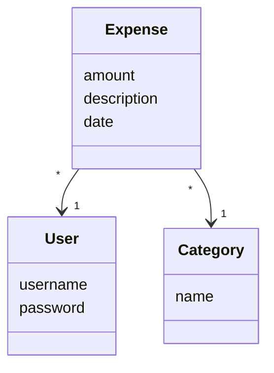
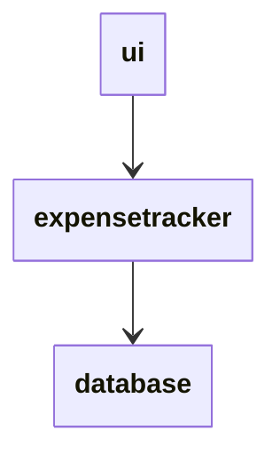
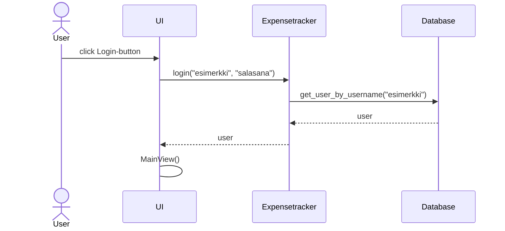
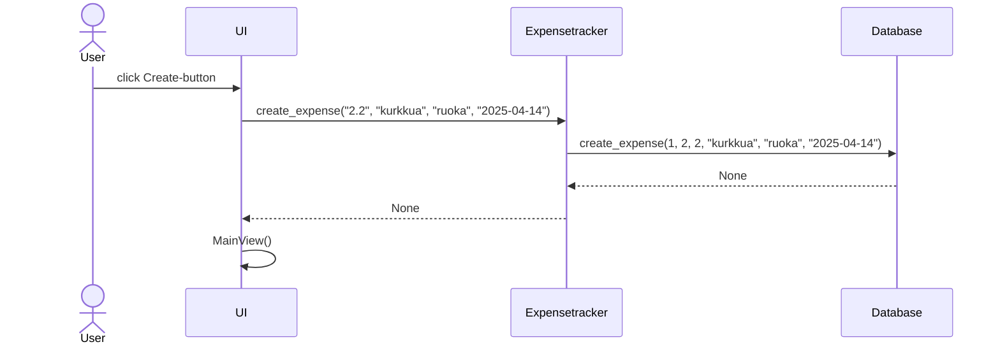

# Arkkitehtuuri

Ohjelma käyttää kolmea keskeistä luokkaa: Expense-luokka kuvaa kirjattua menoa, User-luokka käyttäjää ja Category menokategoriaa. Tietokannassa jokainen näistä luokista vastaa yhtä taulua.

## Ohjelman toiminta

Käyttäjän sisäänkirjautuminen noudattaa seuraavaa sekvenssikaaviota:

Menon kirjaamista kuvaava sekvenssikaavio:

