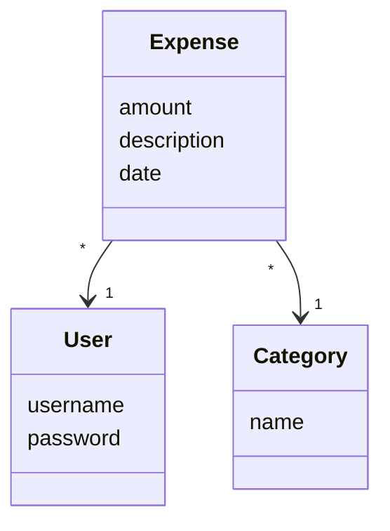
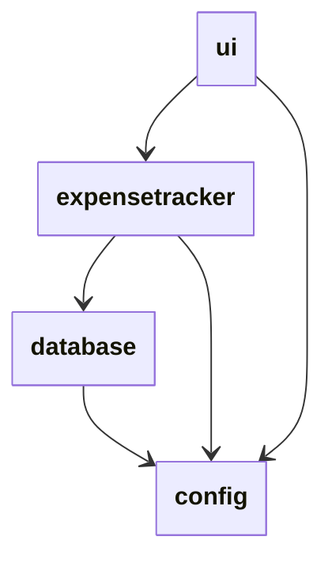
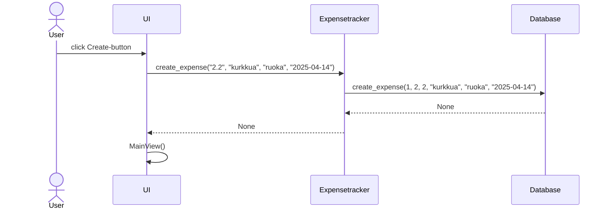
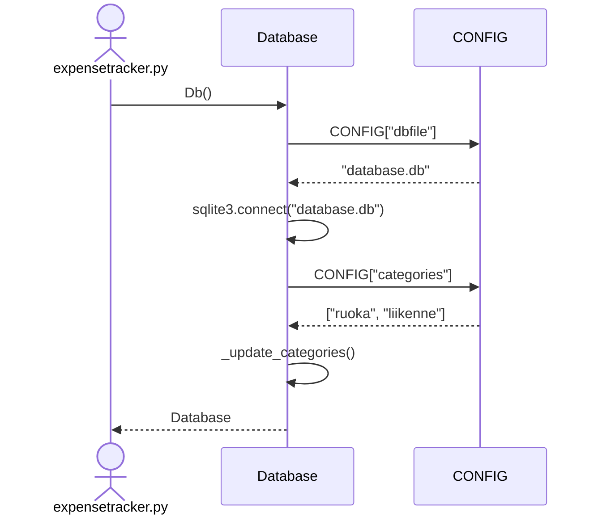

# Arkkitehtuuri

## Luokat

Ohjelma käyttää kolmea keskeistä luokkaa tiedon tallentamiseen: Expense-luokka kuvaa kirjattua menoa, User-luokka käyttäjää ja Category menokategoriaa. Tietokannassa jokainen näistä luokista vastaa yhtä taulua. Nämä luokat eivät varsinaisesti tarjoa mitään omaa toiminnallisuutta (funktioita) pois lukien Expense, jolla on oma funktio usean menon summaamiseen.

Lisäksi ohjelmassa on seuraavat luokat:
- ExpenseTracker - Sovelluslogiikasta vastaava luokka. Ohjelmassa on tästä luokasta yksi globaali instanssi jota käyttöliittymä käyttää.
- MonthData - Luokka, joka sisältää tietoa kuukauden menoista. Ei tarjoa muuta toiminnallisuutta.

Näiden lisäksi globaali muuttuja CONFIG on sanakirja, joka sisältää sovelluksen konfiguraation.

## Pakkausrakenne

Sovelluksen rakenne on kolmikerroksinen: Ohjelman sovelluslogiikka on eriytetty erilliseen luokkaansa nimeltä Expensetracker. Sovelluksen käyttöliittymä kommunikoi Expensetracker-luokasta luodun globaalin instanssin kanssa ja näyttää siltä saamansa datan. Osan datasta käyttöliittymä lukee suoraan konfiguraatiotiedostosta käyttäen globaalia config-instanssia. ExpenseTracker-luokka ottaa konstruktorissa argumenttina tietokantayhteyden ja tallentaa ja lukee dataa tämän yhteyden kautta. Sekä tietokanta että ExpenseTracker lukevat tietoja config-instanssista.

## Järjestelmän pääkomponentit

### ExpenseTracker

Sovelluslogiikasta vastaa luokka nimeltä ExpenseTracker. Tästä luokasta luodaan globaali instanssi jota käyttöliittymä käyttää. Luokka tarjoaa funktioita esimerkiksi liittyen käyttäjien hallintaan ja menojen kirjaamiseen. Kaikki tallentamista vaativa data annetaan tietokannalle tallennettavaksi. Yhteys tähän tietokantaan annetaan luokan konstruktorissa.

### UI

Komponentti, joka vastaa graafisesta käyttöliittymästä hyödyntäen TkInter-kirjastoa. Kommunikoi globaalin ExpenseTracker-instanssin kanssa suorittaakseen käyttäjän haluamat toiminnot ja näyttääkseen tarvittavan datan. Sisältää kolme päänäkymää:
- LoginView, joka tarjoaa ikkunan sisäänkirjautumiseen ja uuden käyttäjän luontiin
- MainView, joka tarjoaa käyttöliittymän uusien menojen kirjaamiseen ja vanhojen menojen tarkasteluun
- StatsView, joka näyttää erillisessä ikkunassa statistiikkaa käyttäjän kuukausittaisista menoista valitulta kuukaudelta

### DataBase

Luokka, joka tarjoaa tietokannan käsittelyyn tarvittavat funktiot. Luo konstruktorissa yhteyden tietokantaan ja on tämän jälkeen valmis suorittamaan ExpenseTracker-luokan pyytämät tehtävät. Tarvittaessa tiedon tallennustapa voidaan muuttaa koskematta sovelluslogiikkaan muokkaamalla tätä luokkaa (kts. [testit](../src/tests/expensetracker_test.py)).

### Config

Globaali sanakirja, joka sisältää sovelluksen käytössä olevat asetukset. Kun ohjelma käynnistetään, lukee load_config-funktio konfiguraatiotiedoston ja asettaa käytössä olevat asetukset. Tämän jälkeen konfiguraatiota voidaan lukea missä kohtaa tahansa ohjelmakoodia. ExpenseTracker, UI ja DataBase lukevat kaikki tietoja tästä konfiguraatiosta.

## Käyttöliittymä

Sovelluksessa on kolme erillistä näkymää:
- LoginView
- MainView
- StatsView

LoginView vastaa kirjautumisikkunan näyttämisestä. Sille annetaan konstruktorissa funktio joka vastaa päänäkymän avaamisesta kirjautumisen jälkeen. MainView näyttää sovelluksen päänäkymän jossa on mahdollista mm. tarkastella omia menoja ja kirjata uusia menoja. Tämä luokka otta konstruktorissa funktion, joka kutsuttaessa näyttää kirjautumisikkunan. Tätä funktiota kutsutaan kun käyttäjä kirjautuu sovelluksesta ulos. StatsView muodostaa erillisen ikkuna kuukausittaisille menoille. Se ottaa konstruktorissa funktion, joka kutsuttaessa lataa pääikkunan uudelleen. Tämä tarvitaan, jotta statistiikkaikkunassa suoritettu menon poisto välittyy myös pääikkunaan.

Eri näkymät hakevat datansa globaalilta ExpenseTracker-instanssilta ja globaalilta CONFIG-instanssilta.

## Datan pysyväistallennus

Sovellus tallentaa tietoa sqlite-tietokantaan. Tietojen tallennuksesta vastaa Database-luokka. Tietokantatiedoston nimi ladataan konfiguraatiotiedostosta. Tietokannassa on kolme eri taulua: Yksi käyttäjille, yksi menoille ja yksi menokategorioille. Näistä käyttäjät ja menot voivat muuttua sovelluksen ollessa käynnissä. Muutokset kategorioihin tapahtuvat muuttamalla konfiguraatiotiedostoa ja tietokantataulu päivitetään aina sovelluksen käynnistyessä uudelleen. Tietokannan tarkan rakenteen näkee [tästä tiedostosta](../src/schema.sql).

## Sekvenssikaaviot

### Käyttäjän sisäänkirjautuminen noudattaa seuraavaa sekvenssikaaviota:

Käyttäjän yrittäessä kirjautua sisään käyttöliittymä lähettää syötetyn salasanan ja käyttäjänimen globaalille ExpenseTracker-instanssille. Tämä tarkastaa tietokannasta täsmäävätkö käyttäjänimi ja salasana. Mikäli ne täsmäävät, expensetracker kirjaa käyttäjän sisään ja palauttaa käyttöliittymälle arvon True. Näin käyttöliittymä saa tietää, että sisäänkirjautuminen onnistui päänäkymän voi näyttää.

### Menon kirjaamista kuvaava sekvenssikaavio:

Kun käyttäjä painaa Create-painiketta päänäkymässä, käyttöliittymä lähettää käyttäjän syöttämät tiedot globaalille ExpenseTracker-instanssille. Tämä lähettää tiedot tietokannalle ja liittää mukaan sillä hetkellä kirjautuneen käyttäjän id:n. Tietokanta tallentaa tiedot. Tämän jälkeen käyttöliittymä lataa itsensä uudelleen jotta uusi meno näkyisi käyttöliittymässä.

### Tietokantayhteyden avaamista kuvaava sekvenssikaaavio:

Tietokantayhteys avataan tiedostossa src/expensetracker.py globaalin ExpenseTracker-instanssin luonnin yhteydessä. Tietokanta lukee globaalista konfiguraatiosta käytössä olevan tietokantatiedoston nimen ja avaa tähän yhteyden. Tämän jälkeen luetaan käytössä olevat kategoriat konfiguraatiosta. Mikäli ne ovat eri kuin tietokannassa, päivitetään tietokannan Categories-taulu. Tämän jälkeen yhteys palautetaan ExpenseTracker-instanssille.

### Loput toiminnallisuudet

Ohjelman kaikki toiminnallisuudet noudattavat samaa perusrakennetta kuin mitä yllä olevat sekvenssikaaviot:
1. Käyttäjä suorittaa toiminnon käyttöliittymässä
2. Käyttöliittymä välittää datan globaalille ExpenseTracker-instanssille
3. expensetracker lukee tarvittaessa konfiguraatiota
4. expensetracker välittää datan tietokannalle
5. Tietokanta tallentaa tiedon
6. Suoritus palaa expensetrackerille joka paluttaa suorituksen käyttöliittymälle
7. Käyttöliittymä latautuu uudestaan näyttääkseen uudet tiedot

## Rakenteelliset parannusideat

Ohjelman käyttöliittymäkoodi on hieman sekavaa. Näkymästä toiseen siirtymisen voisi totetuttaa paremmin src/ui/ui.py-tiedostossa, jolloin koodista tulisi helpompaa hallita ja mahdollisten uusien näkymien lisääminen tulevaisuudessa helpottuisi.

Globaalin konfiguraatiotiedoston voisi poistaa käytöstä ja toteuttaa niin, että globaalilla Expensetracker-luokalla olisi konfiguraatio esimerkiksi attribuuttina. Näin myös konfiguraation hallintaan liittyvän sovelluslogiikan voisi eriyttää paremmin käyttöliittymästä.
