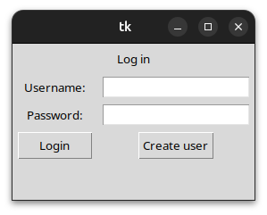
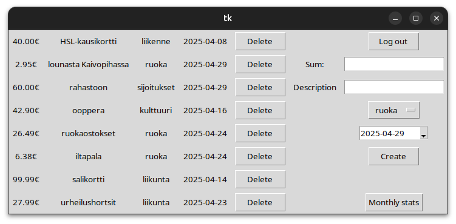
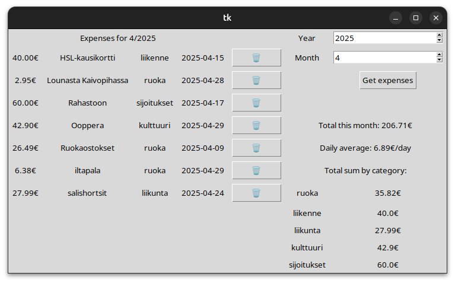

# Käyttöohje

## Ohjelman asennus

Ennen asentamista varmista, että:
- Käytössä on Linux-kone
- Poetry on asennettuna
- Pythonin versio on vähintään 3.11.0

Ohjelman koodin voi hakea joko [GitHubin release-osiosta](https://github.com/maholmlund/ot-harjoitustyo/releases) tai suorittamalla komento
`$ git clone https://github.com/maholmlund/ot-harjoitustyo`

Tämän jälkeen ohjelman riippuvuudet voi asentaa suorittamalla komento `$ poetry install`.

Ohjelma käynnistetään suorittamalla komento `$ poetry run invoke start`.

## Konfigurointi

Ohjelman voi konfiguroida trackerconf.toml-tiedostossa. Tiedosto käyttää [toml-formaattia](https://toml.io). Tiedostossa voidaan määrittää ohjelman käyttämän tietokantatiedoston nimi, käytetty valuutta ja käytössä olevat menokategoriat. Tiedosto on oltava samassa kansiossa kuin mistä ohjelma suoritetaan. Mikäli tiedostoa ei ole tai siinä on syntaksivirheitä, käytetään oletusarvoista konfiguraatiota.

Esimerkkikonfiguraatio (nämä ovat myös edellä mainitut oletusarvot):
```toml
# tietokantatiedoston nimi, merkkijonona
dbfile="database.db"

# käytössä oleva valuutta, merkkijonona
currency="€"

# kategoriat, listana merkkijonoja
categories=["ruoka", "liikenne", "liikunta", "kulttuuri", "sijoitukset"]
```

**HUOM!**

Mikäli käyttössä olevia kategorioita muutetaan konfiguraatiotiedostossa, päivittää ohjelma nämä käytössä olevaan tietokantaan seuraavalla käynnistyskerralla. Jos jokin tietokannassa aiemmin ollut kategoria puuttuu uudesta konfiguraatiosta, poistetaan se tietokannasta ja sen mukana kaikki tähän kategoriaan linkitetyt menot.

## Kirjautuminen ja tunnuksen luonti



Sovellus käynnistyy kirjautumisikkunaan. Sovellukseen voi kirjautua syöttämällä käyttäjänimen ja salasanan niille varattuihin kenttiin ja painamalla Login-painiketta. Mikäli syötetyt tiedot ovat väärin, ilmoitetaan siitä ikkunan alaosaan ilmestyvällä virheviestillä. Mikäli kirjautuminen onnistuu, siirrytään päänäkymään.

Samassa ikkunassa voi myös luoda uuden tunnuksen. Tämä tapahtuu muuten samoin kuin kirjautuminen mutta Login-painikkeen sijasta painetaan Create user -painiketta. Mikäli tunnuksen luonti onnistuu, tulee siitä ilmoitus ikkunan alareunaan. Mikäli taas ei, ilmoitetaan siitäkin ikkunan alareunassa näkyvällä virheviestillä. Onnistuneen tunnuksen luonnin jälkeen järjestelmään voi kirjautua kuten ylempänä on kerrottu.

## Päänäkymä



Päänäkymässä käyttäjä näkee itse kirjaamansa menot ja voi lisätä uusia menoja. Vasemmanpuoleisessa taulukossa listataan käyttäjän aiemmat menot taulukkona. Sarakkeet ovat vasemmalta alkaen: summa, sanallinen kuvaus, kategoria ja päivämäärä. Jokaisen rivin lopussa olevasta painikkeesta voi poistaa kyseisen menon.

Oikealla puolella painike Log out kirjaa käyttäjän ulos ja palauttaa takaisin kirjautumisikkunaan.

Ikkunan oikealla puolella on mahdollista myös luoda uusi meno. Tämä tapahtuu täyttämällä vaaditut kentät ja painamalla Create-painiketta. Huom! Summa kirjoitetaan kenttään käyttäen pistettä desimaalierottimena ja ilman €-merkkiä.

Oikealla alhaalla olevasta painikkeesta käyttäjä pääsee näkemään kuukausittaisia tilastoja omista menoistaan.

## Statistiikka



Statistiikkanäkymään pääsee päänäkymästä painamalla Monthly stats -painiketta. Tämän jälkeen statistiikka avautuu omaan ikkunaansa. Näkymän voi sulkea sulkemalla statistiikkaikkunan normaalisti tai painamalla uudelleen päänäkymän Monthly stats -painiketta.

Ikkunan oikeassa ylänurkassa käyttäjä voi valita minkä kuukauden menoja hän haluaa katsella. Tiedot voi hakea valitsemalla vuoden ja kuukauden (numerona) niitä vastaaviin kenttiin ja painamalla Get expenses -painiketta.

Vasemmassa laidassa oleva taulukko näyttää kaikki valitun kuukauden menot. Sarakkeet menevät samoin kuin päänäkymässä.

Oikeassa reunassa näytetään kuukauden menojen kokonaissumma, päivittäinen keskiarvo ja kokonaissummat kategorioiden perusteella.
