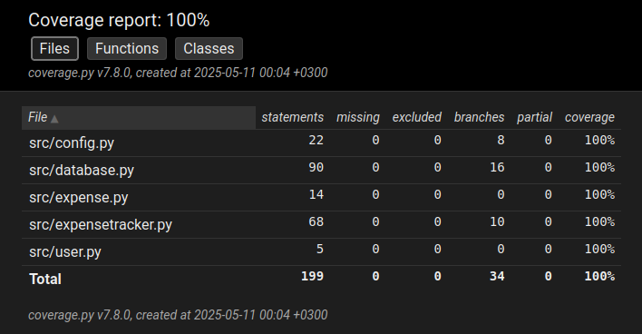

# Testausdokumentti

## Automaattinen testaus
Ohjelmaa on testattu kattavasti automaattisilla yksikkö- ja integraatiotesteillä hyödyntäen unittest-kirjastoa. Testit löytyvät kansiosta src/tests.

**ExpenseTracker**: Luokkaa on testattu kattavasti yksikkötestauksena. Testausta varten luokalle injektoidaan tietokantayhteys, jonka toteuttaa luokka DummyDB. Tämä luokka ei tallenna tietoa tietokantaan vaan pitää sen muistissa ohjelman suorituksen ajan.

**Db**: Luokan yksikkötestauksessa muokataan ohjelman konfiguraatiota niin, että tietokanta kirjoittaa tietonsa .testdb.db-tiedostoon. Tämä varmistaa myös, että käyttäjän varsinainen tietokanta ei tule ylikirjoitetuksi yksikkötestausta suoritettaessa. Jotta testit olisivat erillisiä, tyhjennetään tietokanta ennen jokaista testiä.

**Config**: Jotta konfiguraation lataamista voidaan testata, tehdään käyttäjän varsinaisesta konfiguraatiosta varmuuskopio ennen jokaista testiä. Testin lopuksi varmuuskopio palautetaan. Tällöin käyttäjän varsinainen konfiguraatio ei häviä testatessa.

**Expense**: Tämän luokan osalta testataan yhtä funktiota: sum_expenses.

### Integraatiotestaus

Automaattisesta integraatiotestauksesta vastaa tiedosto integration_test.py. Tässä tiedostossa testataan ExpenseTracker-luokan ja Db-luokan yhteistoimintaa. Tietokantana testatessa käytetään .testdb.db-tiedostoa, jotta käyttäjän varsinainen data ei tuhoudu testatessa.

### Testikattavuus

Testikattavuus on 100%. Mukaan ei lasketa käyttöliittymän koodia.

## Manuaalinen järjestelmätestaus

Sovellusta on testattu manuaalisesti järjestelmätasolla.

**Konfiguraatio**: Testausta on suoritettu ilman konfiguraatiotiedostoa ja virheellisellä konfiguraatiotiedostolla sekä erilaisilla valideilla konfiguraatiotiedoston asetuksilla. Suoritusympäristönä on toiminut yliopiston virtuaalityöasema (Cubbli).

**Testatut ominaisuudet**: Kaikkia määrittelydokumentissa mainittuja ominaisuuksia on testattu eri konfiguraatiotiedoston asetuksilla käyttöohjeen kuvaamalla tavalla. Kenttiin on yritetty syöttää virheellisiä arvoja mm. syöttämällä tekstiä numerokenttään ja antamalla negatiivisia lukuja.

