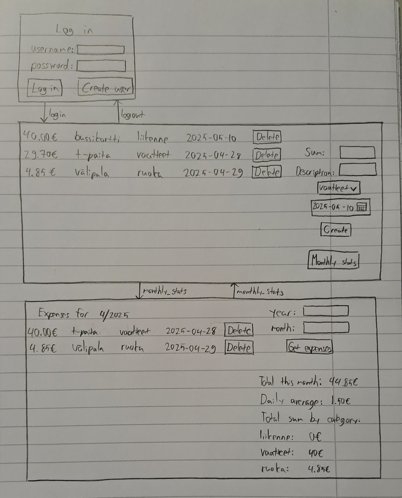

# Vaatimusmäärittely

## Sovelluksen tarkoitus

Sovellus mahdollistaa käyttäjille oman rahan käytön seuraamisen. Seuraaminen
tapahtuu listaamalla omia menoja sovellukseen. Sovellusta on mahdollista
käyttää useammalla käyttäjällä joilla kaikilla on omat kululistansa. Käyttäjät
näkevät sovelluksessa statistiikkaa listaamistaan menoista.

## Käyttäjät

Sovelluksessa on yhtä käyttäjätyyppiä, ns. normaalikäyttäjä.

## Perusversion tarjoama toiminnallisuus

### Ennen kirjautumista

- Käyttäjä voi luoda uuden tunnuksen
  - Tunnuksen täytyy olla vähintään 4 merkkiä
  - Salasanan täytyy olla vähintään 4 merkkiä
- Käyttäjä voi kirjautua sovellukseen syöttämällä käyttäjänimen ja salasana

### Kirjautumisen jälkeen

- Käyttäjä voi lisätä uuden menon
  - Menolle voi määritellä summan
  - Menolle voi valita kategorian valmiista kategorioista
  - Menolle voi asettaa päivämäärän
  - Menolle voi kirjoittaa vapaamuotoisen kuvauksen
- Käyttäjä voi poistaa menon
- Käyttäjä näkee omat aiemmin kirjatut menonsa
- Käyttäjä näkee statistiikkaa omista menoista kuukausittain
  - Kokonaissumman kategorioittain
  - Kuukauden menojen päivittäinen keskiarvo
  - Kuukauden menojen kokonaissumma

### Käyttöliittymäluonnos

Sovelluksessa on kolme näkymää: kirjautumisikkuna ja varsinainen näkymä sekä erillinen statistiikkaikkuna. Uusien käyttäjien luonti tapahtuu samassa kirjautumisikkunassa kuin kirjautuminen. Statistiikkaikkunan saa auki päänäkymästä erillisellä painikkeella.

## Laajennusideat

- Käyttäjä voi muokata aiempia menoja
- Käyttäjä voi määrittää itselleen lisää kategorioita vaikuttamatta muihin käyttäjiin
