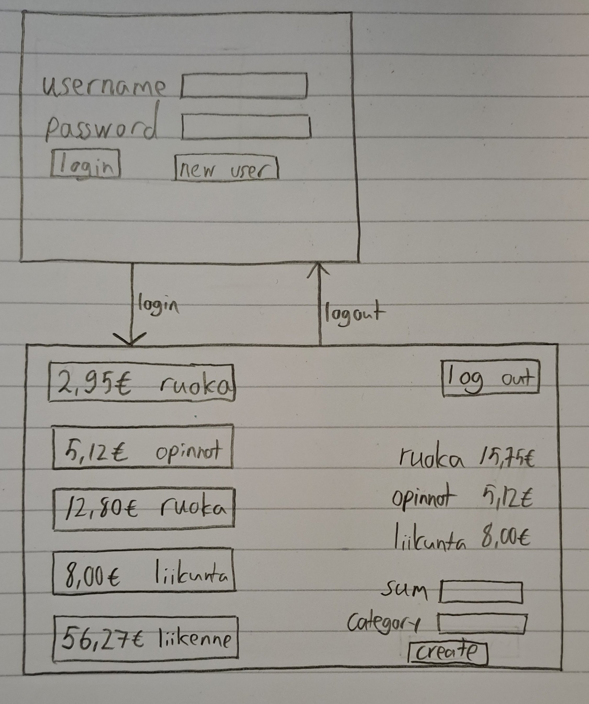

# Vaatimusmäärittely

## Sovelluksen tarkoitus

Sovellus mahdollistaa käyttäjille oman rahan käytön seuraamisen. Seuraaminen
tapahtuu listaamalla omia menoja sovellukseen. Sovellusta on mahdollista
käyttää useammalla käyttäjällä joilla kaikilla on omat kululistansa.

## Käyttäjät

Sovelluksessa on yhtä käyttäjätyyppiä, ns. normaalikäyttäjä.

## Perusversion tarjoama toiminnallisuus

### Ennen kirjautumista

- Käyttäjä voi luoda uuden tunnuksen (tehty)
  - Tunnuksen täytyy olla vähintään 4 merkkiä (tehty)
  - Salasanan täytyy olla vähintään 4 merkkiä (tehty)
- Käyttäjä voi kirjautua sovellukseen syöttämällä käyttäjänimen ja salasana (tehty)

### Kirjautumisen jälkeen

- Käyttäjä voi lisätä uuden menon (tehty)
  - Menolle voi määritellä summan (tehty)
  - Menolle voi valita kategorian valmiista kategorioista (tehty)
  - Menolle voi asettaa päivämäärän (tehty)
- Käyttäjä näkee omat aiemmin kirjatut menonsa (tehty)
- Käyttäjä näkee statistiikkaa omista menoista, mm. (tehty)
  - Kategorian perusteella (tehty)
  - Kuukauden menojen keskiarvo (tehty)

### Käyttöliittymäluonnos

Sovelluksessa on kaksi näkymää: kirjautumisikkuna ja varsinainen näkymä. Uusien käyttäjien luonti tapahtuu samassa kirjautumisikkunassa kuin kirjautuminen.

## Laajennusideat

- Käyttäjä voi itse lisätä uusia menokategorioita
- Käyttäjä voi muokata aiempia menoja
- Käyttäjä voi poistaa menoja (tehty)
- Käyttäjä voi valita missä valuutassa meno on listattu
