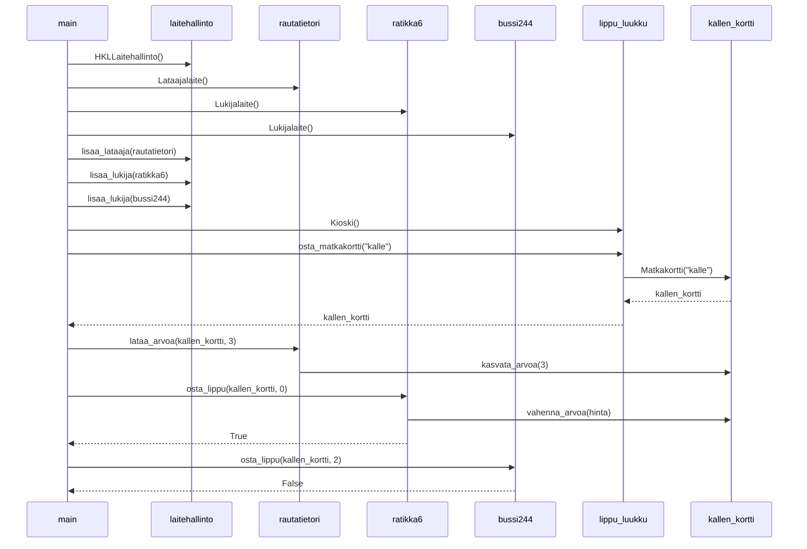

# HSL-sekvenssikaavio

```mermaid
sequenceDiagram
main ->> laitehallinto: HKLLaitehallinto()
main ->> rautatietori: Lataajalaite()
main ->> ratikka6: Lukijalaite()
main ->> bussi244: Lukijalaite()
main ->> laitehallinto: lisaa_lataaja(rautatietori)
main ->> laitehallinto: lisaa_lukija(ratikka6)
main ->> laitehallinto: lisaa_lukija(bussi244)
main ->> lippu_luukku: Kioski()
main ->> lippu_luukku: osta_matkakortti("kalle")
lippu_luukku ->> kallen_kortti: Matkakortti("kalle")
kallen_kortti -->> lippu_luukku: kallen_kortti
lippu_luukku -->> main: kallen_kortti
main ->> rautatietori: lataa_arvoa(kallen_kortti, 3)
rautatietori ->> kallen_kortti: kasvata_arvoa(3)
main ->> ratikka6: osta_lippu(kallen_kortti, 0)
ratikka6 ->> kallen_kortti: vahenna_arvoa(hinta)
ratikka6 -->> main: True
main ->> bussi244: osta_lippu(kallen_kortti, 2)
bussi244 -->> main: False
```
