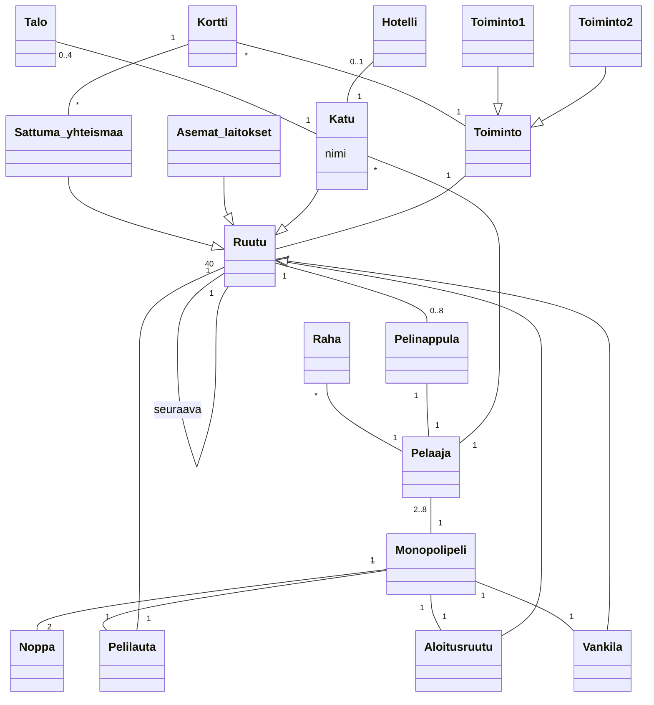

# Monopoli-kaavio

```mermaid
 classDiagram
    Ruutu "1" -- "0..8" Pelinappula
    Monopolipeli "1" -- "2" Noppa
    Monopolipeli "1" -- "1" Pelilauta
    Monopolipeli "1" -- "1" Aloitusruutu
    Monopolipeli "1" -- "1" Vankila
    Raha "*" -- "1" Pelaaja
    Ruutu "1" -- "1" Ruutu: seuraava
    Pelilauta "1" -- "40" Ruutu
    Pelinappula "1" -- "1" Pelaaja
    Pelaaja "2..8" -- "1" Monopolipeli
    Aloitusruutu --|> Ruutu
    Vankila --|> Ruutu
    Sattuma_yhteismaa --|> Ruutu
    Asemat_laitokset --|> Ruutu
    Katu --|> Ruutu
    Katu : nimi
    Toiminto "1" -- "*" Ruutu
    Kortti "1" -- "*" Sattuma_yhteismaa
    Kortti "*" -- "1" Toiminto
    Toiminto1 --|> Toiminto
    Toiminto2 --|> Toiminto
    Talo "0..4" -- "1" Katu
    Hotelli "0..1" -- "1" Katu
    Katu "*" -- "1" Pelaaja
```
